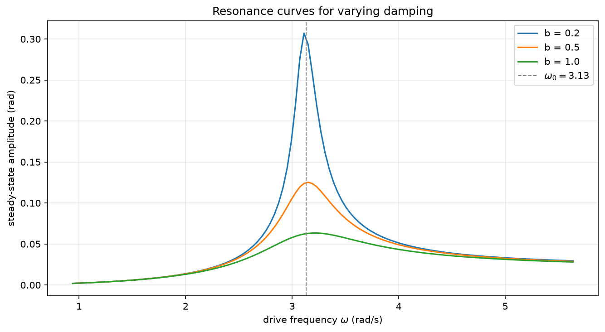
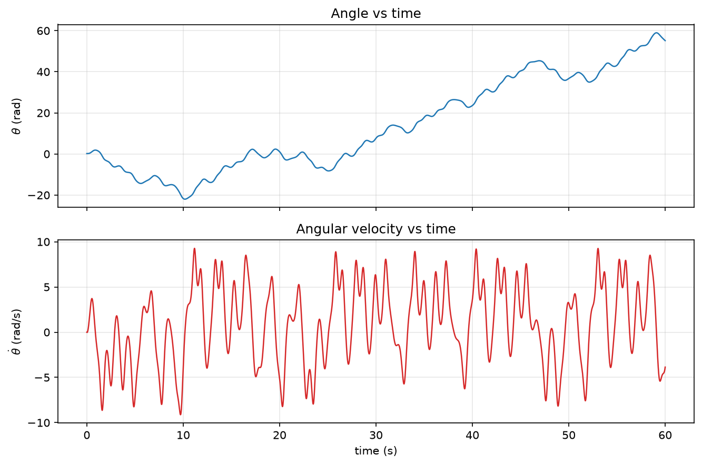
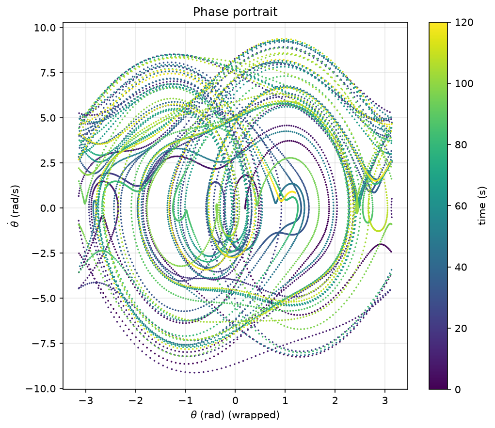
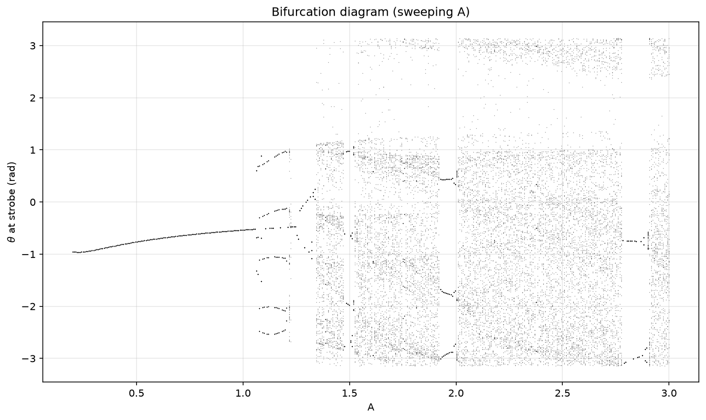
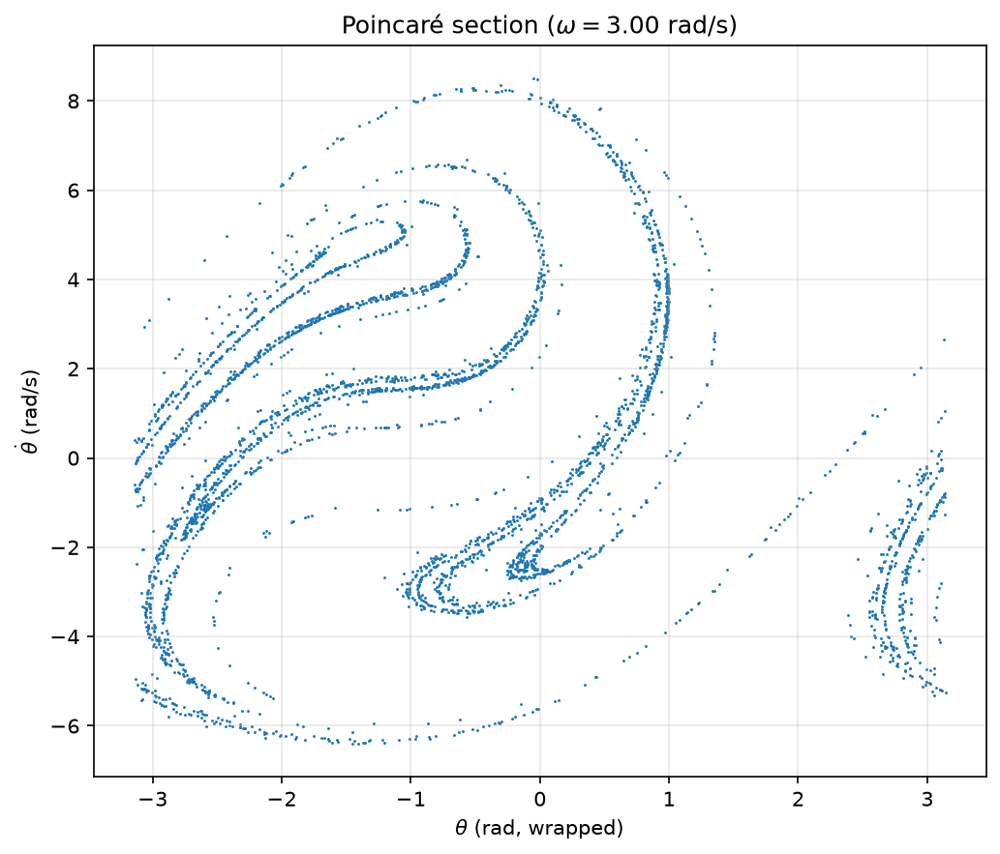
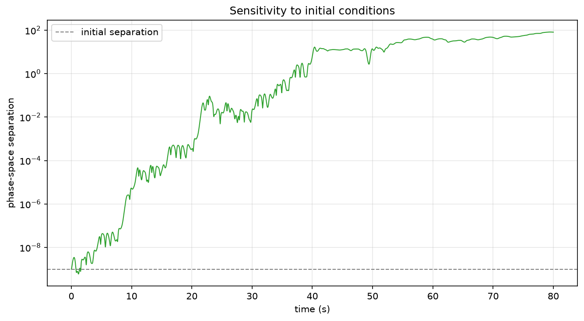
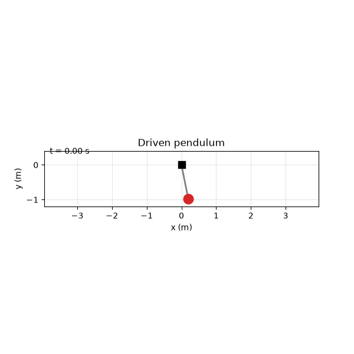

# Driven Pendulum

Simulation and analysis of a **damped pendulum whose pivot is driven horizontally**. The project
provides a small, object-oriented Python library to configure the system, integrate its equation
of motion, capture results as raw data, and explore its rich nonlinear behaviour — from resonance
to deterministic chaos.

## The model

The pivot is moved horizontally as `x_p(t) = A·sin(ωt)`. With `θ` measured from the downward
vertical, length `L`, gravity `g`, and linear damping coefficient `b`, the equation of motion is:

```
θ̈ + b·θ̇ + (g/L)·sin θ = (A·ω²/L)·sin(ωt)·cos θ
```

The left-hand side is an ordinary damped pendulum; the right-hand side is an **inertial forcing**
from the accelerating pivot, modulated by `cos θ` (the pivot acceleration couples to the bob
through the horizontal component of the rod). The system is integrated as the first-order state
`[θ, θ̇]` using `scipy.integrate.solve_ivp`.

**Baseline parameters** (from the brief): `L = 1.0 m`, `m = 1.0 kg`, `g = 9.81 m/s²`,
`b = 0.5 s⁻¹`. The drive `A` and `ω` are free; two sets are used throughout:

| Regime    | A    | ω (rad/s) | Behaviour                          |
|-----------|------|-----------|------------------------------------|
| Regular   | 0.5  | 2.0       | Settles to a periodic oscillation  |
| Chaotic   | 2.5  | 3.0       | Sensitive, aperiodic, strange attractor |

The small-oscillation natural frequency is `ω₀ = √(g/L) ≈ 3.13 rad/s`.

## Installation

Dependencies are managed with [uv](https://docs.astral.sh/uv/). From the project root:

```bash
uv sync
```

That creates a `.venv` and installs everything pinned in `uv.lock`.

> **New to the project or `uv`?** See **[docs/USAGE.md](docs/USAGE.md)** for a step-by-step guide:
> installing `uv`, getting the code, running every script, and running your own experiments.

## Usage

### As a library

```python
from driven_pendulum import DrivenPendulum, PendulumParameters

# Configure (immutable; .with_updates() returns a modified copy)
params = PendulumParameters(L=1.0, b=0.5, A=2.5, omega=3.0)
model = DrivenPendulum(params)

# Run
result = model.simulate(theta0=0.2, theta_dot0=0.0, t_span=(0, 60), n_points=6000)

# Capture raw data
df = result.to_dataframe()        # tidy pandas DataFrame (raw + derived quantities)
result.to_csv("outputs/run.csv")  # or straight to CSV

# Derived physics is available on demand
result.total_energy, result.bob_x, result.bob_y, result.pivot_x
```

### Visualisation

```python
from driven_pendulum.plotting import plot_time_series, plot_phase_portrait, animate

plot_time_series(result, save_path="outputs/timeseries.png")
plot_phase_portrait(result, save_path="outputs/phase.png")
animate(result, save_path="outputs/pendulum.gif")
```

### Example scripts

Each script writes figures (and some CSVs) to `outputs/`:

```bash
uv run python scripts/run_timeseries.py      # angle/velocity vs time, both regimes
uv run python scripts/run_phase_portrait.py  # phase portraits + energy
uv run python scripts/run_resonance.py       # resonance curves vs damping
uv run python scripts/run_poincare.py        # stroboscopic Poincaré section
uv run python scripts/run_bifurcation.py     # bifurcation diagram (sweep A)
uv run python scripts/run_sensitivity.py     # divergence of nearby trajectories
uv run python scripts/run_animation.py       # animated GIF
uv run python scripts/run_all.py             # everything
```

### Custom runs

To experiment with your own parameters, use [scripts/run_custom.py](scripts/run_custom.py). It runs
one simulation, prints a summary, saves figures + CSV, and can display the plots with `--show`:

```bash
# Pick your own amplitude/frequency, run for 60 s, and open the plots
uv run python scripts/run_custom.py --A 1.3 --omega 2.7 --t 60 --show

# Or let it choose random drive parameters for you
uv run python scripts/run_custom.py --random --t 60 --show
```

See [docs/USAGE.md](docs/USAGE.md) for the full flag reference and more examples.

## What the system does

### Resonance

Sweeping the drive frequency with a small amplitude traces the classic resonance curve. The peak
sits right at the natural frequency `ω₀ = √(g/L) ≈ 3.13 rad/s`; heavier damping lowers and
broadens it.



### Time series and phase portraits

At a modest drive the pendulum settles into a steady periodic swing; at a strong drive the motion
never repeats. The phase portrait of the chaotic regime fills a structured region of phase space
rather than tracing a closed loop.




### Route to chaos — bifurcation diagram

Sweeping the drive amplitude `A` (at `ω = 3.0`) shows a period-1 branch, a period-doubling
cascade near `A ≈ 1.1`, broad chaotic bands, and periodic windows embedded within them.



### Strange attractor — Poincaré section

Sampling the state once per drive period (a stroboscopic map) in the chaotic regime reveals the
fractal filaments of a strange attractor.



### Sensitivity to initial conditions

Two trajectories starting `10⁻⁹ rad` apart stay together in the regular regime but diverge by a
factor of ~`10¹¹` in the chaotic regime — the hallmark of a positive Lyapunov exponent.



### Animation



## Project structure

```
src/driven_pendulum/
  parameters.py   PendulumParameters — validated, immutable physical configuration
  model.py        DrivenPendulum — equation of motion + solve_ivp integration
  result.py       SimulationResult — raw arrays, derived physics, DataFrame/CSV export
  analysis.py     resonance_sweep, poincare_section, bifurcation_diagram, sensitivity…
  plotting.py     time series, phase portrait, energy, resonance, Poincaré, bifurcation, animation
scripts/          runnable examples that regenerate everything in outputs/
tests/            physics-validation test suite (pytest)
```

The design separates concerns cleanly: **parameters** are an immutable value object, the **model**
owns the dynamics (the equation of motion is defined exactly once and reused everywhere),
**results** hold and export data, **analysis** builds higher-level experiments on top of the model,
and **plotting** is the only place that touches Matplotlib.

## Testing

The test suite validates the simulator against known physics rather than golden numbers:

- equilibrium stays at rest;
- the small-angle period matches `2π√(L/g)`;
- total energy is conserved in the conservative limit (`b = 0`, `A = 0`);
- damping dissipates energy monotonically to rest;
- the resonance peak falls at `√(g/L)`;
- nearby trajectories diverge in the chaotic regime;
- data-export shapes and derived quantities are correct.

```bash
uv run pytest
```

## Notes on numerics

- Integration uses `RK45` with tight tolerances (`rtol = atol = 1e-9`) by default; `DOP853` is
  available via the `method` argument for long chaotic runs.
- Energy in `SimulationResult` is computed in the lab frame **including** the moving pivot, so it
  is only constant in the undriven, undamped limit — exactly the case used for the conservation
  test.
- Chaotic trajectories are not reproducible point-by-point over long times (that is the physics,
  not a bug); statistical structures like the Poincaré section and bifurcation diagram are robust.
